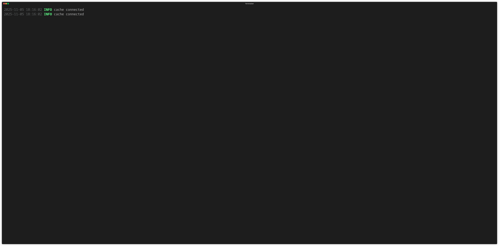

# pnmd
🪵 **My personal slog.Handler with struct fields**

`pnmd` provides a minimal [slog.Handler](https://pkg.go.dev/log/slog#Handler) based on [pterm](https://github.com/pterm/pterm) that prints logs as a compact tree:
timestamp, level, message, structured attributes, and optional caller info.

## Demo


---

## Example

```go
package main

import (
	"log/slog"
)

func main() {
	logger := Get().
		Configure(Options{Level: slog.LevelDebug}).
		DisableCallerFor(slog.LevelInfo).
		EnableCallerFor(slog.LevelError)

	logger.Debug("initializing cache subsystem", "cache", "redis", "host", "localhost", "port", 6379)

	logger.Info("cache connected")

	logger.Warn("slow query detected", "duration_ms", 1823, "query", "SELECT * FROM users WHERE active=1", "user", "analytics-worker")

	logger.Error("failed to write audit event", "error", "disk full", "path", "/var/log/audit.json", "component", "audit", "retry_in_sec", 30)

	logger.Debug("config reloaded", "file", "/etc/app/config.yaml", "changes", 5)

	logger.Info("http server started", "addr", ":8080", "threads", 8)

	logger.Warn("deprecated API usage", "endpoint", "/v1/legacy", "client", "mobile-android", "version", "1.2.0")

	logger.Error("user authentication failed", "user", "john", "ip", "192.168.1.42", "reason", "invalid token")

	logger.Debug("background job finished", "job_id", "import-2025-11-05", "rows", 152_000, "duration_sec", 94.2)

	logger.Info("graceful shutdown complete", "uptime_min", 238)
}

```
---

This project is licensed under the [MIT License](LICENSE).
